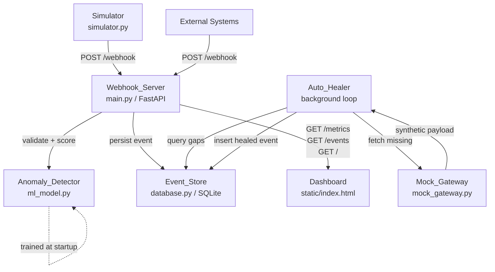

# Design Document: Webhook Reconciliation Microservice

## Overview

The webhook reconciliation microservice is a Python/FastAPI application that ingests payment webhook events, persists them idempotently in SQLite, scores each payload in real-time using an Isolation Forest anomaly detector, and runs a background auto-healing loop to repair missing or out-of-order transactions. A glassmorphism dashboard polls a metrics API for live monitoring, and a simulator script generates synthetic traffic for end-to-end testing.

The system is intentionally self-contained: all persistence is local SQLite, the ML model is trained on startup from synthetic data, and the "external" payment gateway is a mock stub. This makes the service runnable with a single command and zero external dependencies beyond Python packages.

---

## Architecture



**Request flow for POST /webhook:**
1. FastAPI receives JSON payload
2. Pydantic validates required fields (`transaction_id`, `status`, `timestamp`)
3. Idempotency check against Event_Store (return 200 early if duplicate)
4. Anomaly_Detector scores the payload (< 100ms)
5. Event persisted with `anomaly_score` and `is_anomaly` flag
6. HTTP 200 returned

**Auto-healing flow (every 30s):**
1. Query Event_Store for all distinct `transaction_id` values
2. For each transaction, check expected status sequence for gaps
3. For each gap, call `Mock_Gateway.fetch_missing_event()`
4. Insert healed event with `is_healed=True` and `healed_at` timestamp
5. Detect and flag out-of-order events by comparing `timestamp` vs `received_at` ordering

---

## Components and Interfaces

### Webhook_Server (`main.py`)

FastAPI application. Owns the HTTP layer, startup lifecycle, and background task scheduling.

```python
# Key endpoints
POST /webhook          # ingest event
GET  /metrics          # aggregated stats + recent events
GET  /events           # paginated event list
GET  /                 # serve dashboard HTML
```

Startup sequence:
1. `Event_Store.init_db()` — create tables
2. `Anomaly_Detector.train()` — fit model on synthetic data
3. `Auto_Healer.start()` — launch background asyncio task

### Event_Store (`database.py`)

SQLAlchemy Core (not ORM) over SQLite. Exposes a small set of functions:

```python
def init_db() -> None
def insert_event(event: dict) -> None          # raises IntegrityError on duplicate idempotency_key
def event_exists(idempotency_key: str) -> bool
def get_metrics() -> dict                       # counts + 10 most recent
def get_events(page: int, page_size: int) -> list[dict]
def get_all_transactions() -> dict[str, list]  # for auto-healer gap analysis
def insert_healed_event(event: dict) -> None
```

### Anomaly_Detector (`ml_model.py`)

Wraps `sklearn.ensemble.IsolationForest`. Feature vector is derived from the webhook payload.

```python
class AnomalyDetector:
    def train(self, contamination: float = 0.1) -> None
    def score(self, payload: dict) -> tuple[float, bool]  # (score, is_anomaly)
```

Feature extraction: `[amount_cents, delay_seconds, status_ordinal]` — numeric features extracted from the payload. Synthetic training data covers normal payment timelines with injected outliers.

### Auto_Healer (`main.py` — background coroutine)

```python
async def auto_heal_loop(interval_seconds: int = 30) -> None
```

Expected status sequence: `initiated → processing → completed | failed`

Gap detection logic:
- For each `transaction_id`, collect observed statuses
- Compute missing statuses relative to the expected sequence up to the terminal status
- For each missing status, call `Mock_Gateway.fetch_missing_event()`

Out-of-order detection:
- Compare `timestamp` field ordering vs `received_at` ordering for each transaction
- Flag events where the two orderings disagree

### Mock_Gateway (`mock_gateway.py`)

```python
def fetch_missing_event(transaction_id: str, missing_status: str) -> dict
```

Returns a synthetic payload. Sleeps `random.uniform(0.05, 0.2)` seconds to simulate latency. Raises `ValueError` for unrecognised `missing_status`.

### Dashboard (`static/index.html`)

Single-file HTML/CSS/JS. Polls `GET /metrics` every 3 seconds via `fetch()`. No build step, no framework.

### Simulator (`simulator.py`)

Standalone script. Sends four traffic patterns sequentially:
1. Normal sequential transactions
2. Duplicate events (same idempotency key)
3. Transactions with missing intermediate statuses
4. Out-of-order events (delayed sends)

Catches `requests.ConnectionError` per event and continues.

---

## Data Models

### SQLite Schema

```sql
CREATE TABLE IF NOT EXISTS webhook_events (
    id              INTEGER PRIMARY KEY AUTOINCREMENT,
    idempotency_key TEXT    NOT NULL UNIQUE,   -- transaction_id + ":" + status
    transaction_id  TEXT    NOT NULL,
    status          TEXT    NOT NULL,
    timestamp       TEXT    NOT NULL,          -- ISO-8601 from payload
    payload         TEXT    NOT NULL,          -- raw JSON string
    received_at     TEXT    NOT NULL,          -- ISO-8601, set by server
    anomaly_score   REAL,
    is_anomaly      INTEGER NOT NULL DEFAULT 0, -- 0/1 boolean
    is_healed       INTEGER NOT NULL DEFAULT 0,
    healed_at       TEXT                        -- ISO-8601, nullable
);

CREATE INDEX IF NOT EXISTS idx_transaction_id ON webhook_events(transaction_id);
CREATE INDEX IF NOT EXISTS idx_received_at    ON webhook_events(received_at DESC);
```

**Idempotency key** is derived as `f"{transaction_id}:{status}"` — one record per (transaction, status) pair. This is the natural idempotency unit for payment lifecycle events.

### Pydantic Request Model

```python
class WebhookPayload(BaseModel):
    transaction_id: str
    status: str
    timestamp: str
    amount_cents: int | None = None
    metadata: dict | None = None
```

### Metrics Response Shape

```json
{
  "total_events": 42,
  "anomaly_count": 3,
  "healed_count": 2,
  "recent_events": [ /* last 10 webhook_events rows as dicts */ ]
}
```

### Events Response Shape

```json
{
  "events": [ /* webhook_events rows */ ],
  "page": 1,
  "page_size": 20,
  "total": 42
}
```

---

## Correctness Properties

*A property is a characteristic or behavior that should hold true across all valid executions of a system — essentially, a formal statement about what the system should do. Properties serve as the bridge between human-readable specifications and machine-verifiable correctness guarantees.*

### Property 1: Payload validation rejects any incomplete payload

*For any* JSON payload missing at least one of `transaction_id`, `status`, or `timestamp`, the Webhook_Server SHALL return HTTP 422.

**Validates: Requirements 1.2, 1.3**

---

### Property 2: Valid payloads are accepted within latency budget

*For any* valid webhook payload, the Webhook_Server SHALL return HTTP 200 within 500ms.

**Validates: Requirements 1.4**

---

### Property 3: Concurrent ingestion produces no duplicate records

*For any* batch of N distinct valid payloads sent concurrently, the Event_Store SHALL contain exactly N new records after all requests complete, with no duplicate `idempotency_key` values.

**Validates: Requirements 1.5**

---

### Property 4: Event persistence round-trip

*For any* valid webhook event that is accepted and persisted, querying the Event_Store by `idempotency_key` SHALL return a record containing all original fields (`transaction_id`, `status`, `timestamp`, `payload`, `received_at`, `anomaly_score`).

**Validates: Requirements 2.1, 3.5**

---

### Property 5: Idempotent ingestion

*For any* valid webhook event, sending it twice SHALL result in exactly one record in the Event_Store and both requests SHALL return HTTP 200.

**Validates: Requirements 2.2**

---

### Property 6: Anomaly scoring latency

*For any* valid webhook payload, the Anomaly_Detector SHALL produce a score within 100ms.

**Validates: Requirements 3.2**

---

### Property 7: Anomaly flag consistency

*For any* webhook payload that the Anomaly_Detector classifies as anomalous, the persisted event record SHALL have `is_anomaly = 1`.

**Validates: Requirements 3.3**

---

### Property 8: Auto-healer fills gaps

*For any* transaction sequence with a missing intermediate status, after one auto-heal cycle the Event_Store SHALL contain a record for the missing status with `is_healed = 1` and a non-null `healed_at` timestamp.

**Validates: Requirements 4.2, 4.3, 4.6**

---

### Property 9: Auto-healer ordering invariant

*For any* transaction whose events were received out of chronological order, after one auto-heal cycle the events for that transaction SHALL be retrievable in correct `timestamp` order.

**Validates: Requirements 4.4**

---

### Property 10: Mock_Gateway output structure

*For any* valid `transaction_id` and recognised `missing_status`, `fetch_missing_event` SHALL return a dict containing `transaction_id`, `status`, `timestamp`, and `payload` keys.

**Validates: Requirements 5.2**

---

### Property 11: Mock_Gateway rejects unknown statuses

*For any* string that is not a recognised payment status, `fetch_missing_event` SHALL raise an exception.

**Validates: Requirements 5.3**

---

### Property 12: Mock_Gateway latency bounds

*For any* call to `fetch_missing_event`, the call SHALL complete in between 50ms and 200ms.

**Validates: Requirements 5.4**

---

### Property 13: Metrics response completeness

*For any* state of the Event_Store, `GET /metrics` SHALL return a JSON object containing `total_events`, `anomaly_count`, `healed_count`, and `recent_events` (at most 10 items), with counts matching the actual data.

**Validates: Requirements 6.2**

---

### Property 14: Metrics response latency

*For any* state of the Event_Store, `GET /metrics` SHALL respond within 200ms.

**Validates: Requirements 6.3**

---

### Property 15: Events endpoint ordering invariant

*For any* state of the Event_Store, `GET /events` SHALL return events ordered by `received_at` descending.

**Validates: Requirements 6.4**

---

### Property 16: Simulator resilience

*For any* connection failure to the Webhook_Server, the Simulator SHALL log the error and continue sending remaining events without raising an unhandled exception.

**Validates: Requirements 8.5**

---

## Error Handling

| Scenario | Component | Behaviour |
|---|---|---|
| Missing required field | Webhook_Server | FastAPI/Pydantic returns 422 with field-level error detail |
| Duplicate idempotency key | Event_Store | `event_exists()` check before insert; return 200 early |
| DB integrity error on insert | Event_Store | Catch `IntegrityError`, treat as duplicate, return 200 |
| Anomaly model not trained | Anomaly_Detector | Raise `RuntimeError` at startup; server does not start |
| Mock_Gateway unavailable | Auto_Healer | Catch `Exception`, log with `logging.error()`, continue loop |
| Mock_Gateway unknown status | Mock_Gateway | Raise `ValueError` with descriptive message |
| Port already in use | Startup_Script | `netstat` check in `.bat`; print error and exit |
| Simulator server unreachable | Simulator | Catch `requests.ConnectionError` per request; log and continue |

All background task exceptions are caught at the loop level so the auto-healer never crashes the server process.

---

## Testing Strategy

### Unit Tests

Focus on specific examples, edge cases, and error conditions:

- `test_missing_field_returns_422` — each required field missing individually
- `test_duplicate_event_returns_200_no_duplicate_record` — idempotency example
- `test_anomaly_detector_trains_without_error` — smoke
- `test_mock_gateway_unknown_status_raises` — error condition
- `test_auto_healer_gateway_failure_does_not_crash` — error condition
- `test_metrics_endpoint_returns_required_keys` — structure check
- `test_events_endpoint_pagination` — pagination example

### Property-Based Tests

Uses **Hypothesis** (Python PBT library). Each property test runs a minimum of 100 iterations.

Property tests are tagged with comments in the format:
`# Feature: webhook-reconciliation-microservice, Property N: <property_text>`

| Property | Test Description |
|---|---|
| P1 | Generate payloads with random subsets of required fields removed; assert 422 |
| P2 | Generate random valid payloads; assert 200 and measure latency |
| P3 | Generate N random distinct payloads; send concurrently; assert exactly N records |
| P4 | Generate random valid events; persist; query back; assert field equality |
| P5 | Generate random valid events; send twice; assert count=1 and both return 200 |
| P6 | Generate random valid payloads; score; assert latency < 100ms |
| P7 | Generate anomalous payloads (extreme feature values); assert is_anomaly=1 |
| P8 | Generate transactions with random gaps; run healer; assert gaps filled with is_healed=1 |
| P9 | Generate out-of-order transactions; run healer; assert chronological ordering |
| P10 | Generate random transaction_ids + valid statuses; assert output has required keys |
| P11 | Generate random non-status strings; assert ValueError raised |
| P12 | Call fetch_missing_event N times; assert each call in [50ms, 200ms] |
| P13 | Generate random event sets; call /metrics; assert counts match actual data |
| P14 | Vary event store size; call /metrics; assert latency < 200ms |
| P15 | Generate random events with varying timestamps; call /events; assert descending order |
| P16 | Run simulator against unreachable server; assert no unhandled exception |

**Property reflection — redundancy check:**
- P4 and P5 are distinct: P4 tests field completeness, P5 tests idempotency count. Both kept.
- P8 and P9 are distinct: P8 tests gap filling, P9 tests ordering. Both kept.
- P10, P11, P12 all test Mock_Gateway but from different angles (structure, error, latency). All kept.
- P13 and P14 both test /metrics but from different angles (correctness vs latency). Both kept.

### Integration Tests

- Start full FastAPI app with `TestClient`; send simulator traffic; verify end-to-end event counts and healing
- Verify `reconciliation.db` is created on startup
- Verify dashboard HTML is served at `/`

### Test Configuration

```python
# Hypothesis settings
from hypothesis import settings
settings.register_profile("ci", max_examples=100)
settings.load_profile("ci")
```
